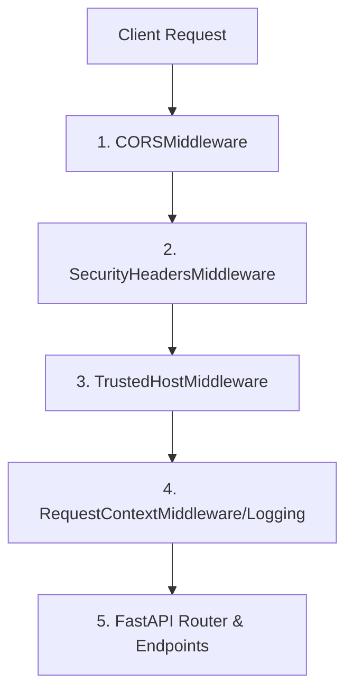

# API Governance Review Report (Phase 3.6)

This report presents a thorough audit of the `TaskSyncEnterprise` backend API architecture, routing structure, middleware pipelines, authentication flow, exception handlers, and rate limiting.

---

## 🛣️ 1. API Routing Structure
* **Central Endpoint Router**: The application uses a central router defined in [api.py](file:///e:/TaskSyncEnterprise/backend/app/routers/api.py), which groups and mounts sub-routers from `app.routers.v1` (including `health`, `auth`, `employees`, `tasks`, `projects`, `departments`, `teams`, etc.).
* **Mounting & Versioning**: The API router is mounted in [main.py](file:///e:/TaskSyncEnterprise/backend/app/main.py#L82) with the prefix `settings.API_V1_STR` (which defaults to `/api/v1`).
* **Root & SRE Probes**:
  * Root endpoint `@app.get("/")` is mounted at the root level of the application.
  * Health check router (`health.router`) is mounted at root level (`/health`, `/health/live`, `/health/ready`) to support Kubernetes/SRE platform monitoring probes.

---

## 🧱 2. Middleware Architecture & Execution Order
FastAPI uses Starlette's middleware stack, which processes requests from the last added middleware (outermost) to the first added middleware (innermost). The current middlewares registered in [main.py](file:///e:/TaskSyncEnterprise/backend/app/main.py#L53-L71) are:
1. `LoggingMiddleware` (RequestContextMiddleware) - added first
2. `TrustedHostMiddleware` - added second
3. `SecurityHeadersMiddleware` - added third
4. `CORSMiddleware` - added last

### 🔄 Request Flow Order


### 🔬 Observations
* **CORS Preflight**: `CORSMiddleware` correctly sits outermost. It intercepts and returns early responses for browser `OPTIONS` preflight checks without routing or logging overhead.
* **Request Context**: `LoggingMiddleware` successfully establishes request context variables (correlation `X-Request-ID` and start time tracker) before downstream endpoints execute.
* **Missing Governance**: There is currently no API versioning validation, idempotency caching, deprecation tracking, or rate-limiting middleware in the pipeline.

---

## 🔒 3. Authentication & Dependency Injection
* **Authentication**: Implemented using JWT tokens via OAuth2 Password Bearer flow in [deps.py](file:///e:/TaskSyncEnterprise/backend/app/core/deps.py).
* **Blacklist Shield**: It checks a database table (`TokenBlacklist`) to instantly invalidate revoked tokens (e.g. from user logout events).
* **Role-Based Access Control (RBAC)**: Handled via the custom `require_roles` dependency factory:
  * `RequireAdmin = require_roles([ROLE_ADMIN])`
  * `RequireManager = require_roles([ROLE_ADMIN, ROLE_MANAGER])`
  * `RequireEmployee = require_roles([ROLE_ADMIN, ROLE_MANAGER, ROLE_EMPLOYEE])`
* **Dependency Lifetime**: Database sessions are injected via `get_db` using a scoped dependency (`yield Session`), ensuring connection pool safety and transactional integrity.

---

## ⚡ 4. Existing Rate Limiter
* **Status**: **No rate limiter is currently configured or implemented** in the codebase.
* **Findings**:
  * There are no references to rate limits in `requirements.txt` or the application middleware stack.
  * We must design and build a Redis-based sliding window rate-limiting middleware from scratch to protect the endpoints.

---

## ⚠️ 5. Exception Handling
* **Location**: Configured in [exception_handler.py](file:///e:/TaskSyncEnterprise/backend/app/handlers/exception_handler.py).
* **Mechanism**: Binds standard FastAPI exception categories (`BaseAppException`, `StarletteHTTPException`, `RequestValidationError`, `SQLAlchemyError`, `ValueError`, etc.) to a centralized handler `unified_exception_handler`.
* **Output Format**: Encapsulates errors inside Pydantic structures defined in [response.py](file:///e:/TaskSyncEnterprise/backend/app/schemas/response.py#L173):
  ```json
  {
      "success": false,
      "message": "Error description message",
      "error_code": "CUSTOM_ERROR_CODE",
      "details": null,
      "trace_id": "correlation-uuid"
  }
  ```

---

## 📄 6. Swagger & OpenAPI Configuration
* Swagger documentation is generated natively at `/docs` (using Swagger UI) and `/redoc` (using ReDoc).
* Path operation routing definitions contain tags, titles, and schema references.
* Swagger does not currently reflect any custom deprecation timelines or sunset meta-headers.

---

## 🔍 7. Potential Architectural Conflicts & Ordering Recommendations
1. **Middleware Ordering**: 
   * Version validation should run *inside* logging middleware to ensure telemetry captures invalid requests.
   * Rate limiting must execute *early* (before database operations or idempotency checks) to avoid Redis/database connection resource exhaustion under DDoS or brute-force attacks.
   * Idempotency checks must run *after* logging but *before* endpoints. If a hit is found in Redis, the cached response should return immediately.
2. **Starlette Middleware Exception Handling**:
   * Standard custom FastAPI exception handlers do NOT automatically catch exceptions raised during Starlette middleware dispatch methods.
   * Governance middlewares (Versioning, Idempotency, Rate Limiting) must catch internal failures and return structured `JSONResponse` packets rather than raising exceptions that bypass formatting.
