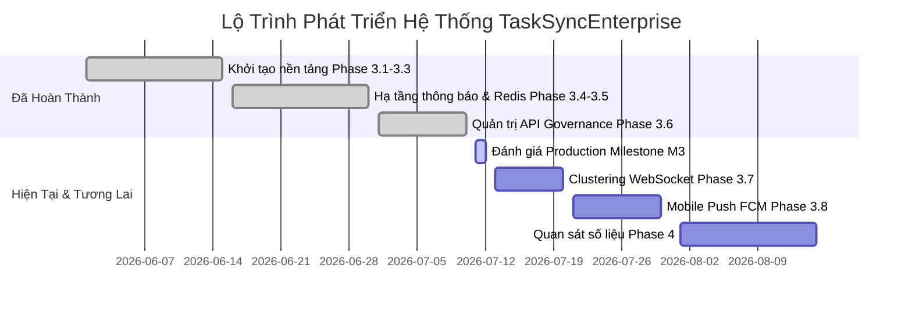

# Lộ Trình Phát Triển Dự Án (Project Development Roadmap)

Tài liệu này tổng hợp lộ trình phát triển, trạng thái hoàn thành và tiến độ các mốc Milestone của dự án `TaskSyncEnterprise`.

---

## 📅 1. Bảng Trạng Thái Phát Triển (Development Status Matrix)

| Giai Đoạn (Phase) | Nội Dung Công Việc | Trạng Thái (Status) | Tiến Độ (Progress) |
| :--- | :--- | :--- | :--- |
| **Phase 3.1** | Quản Lý Cấu Hình & Kiểm Tra Sức Khỏe (SRE Probes) | **Hoàn Thành (Completed)** | 100% |
| **Phase 3.2** | Chuẩn Hóa Cấu Trúc File & Logging Context | **Hoàn Thành (Completed)** | 100% |
| **Phase 3.3** | Bộ Lọc Tìm Kiếm & Định Dạng Kết Nối Dynamic | **Hoàn Thành (Completed)** | 100% |
| **Phase 3.4** | Đa Kênh Thông Báo & Cổng WebSocket | **Hoàn Thành (Completed)** | 100% |
| **Phase 3.5** | Bộ Nhớ Đệm Redis Cache & Đồng Bộ Trạng Thái | **Hoàn Thành (Completed)** | 100% |
| **Phase 3.6** | Quản Trị API (Versioning, Idempotency, Deprecation) | **Hoàn Thành (Completed)** | 100% |
| **Milestone M3** | Đánh Giá Sản Xuất & Tối Ưu Hóa Clean Code | **Đang Thực Hiện (Current)** | 95% |
| **Phase 3.7** | Đồng Bộ WebSocket Bằng Redis Pub/Sub | **Kế Hoạch (Planned)** | 0% |
| **Phase 3.8** | Tích Hợp Thông Báo Di Động FCM Push | **Kế Hoạch (Planned)** | 0% |
| **Phase 4** | Quan Sát Số Liệu (Prometheus, Grafana, OpenTelemetry) | **Kế Hoạch (Planned)** | 0% |

---

## 📈 2. Lịch Trình Phát Triển (Milestones Timeline)

---

## 🛠️ 3. Tiến Độ Milestone M3 Hiện Tại

Milestone M3 tập trung hoàn toàn vào việc dọn dẹp các mã debug, loại bỏ print rác, bổ sung Docker đóng gói an toàn và viết tài liệu hướng dẫn chuẩn doanh nghiệp. 

* **Tiến độ tổng thể**: **95%**
* **Trạng thái**: Đã sẵn sàng kích hoạt chuyển giao.
* **Mục tiêu tiếp theo**: Chuyển giao Phase 3.7 WebSocket Clustering.
